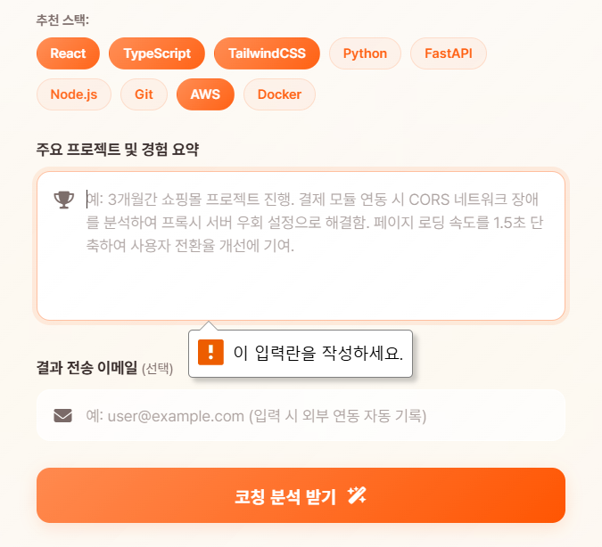
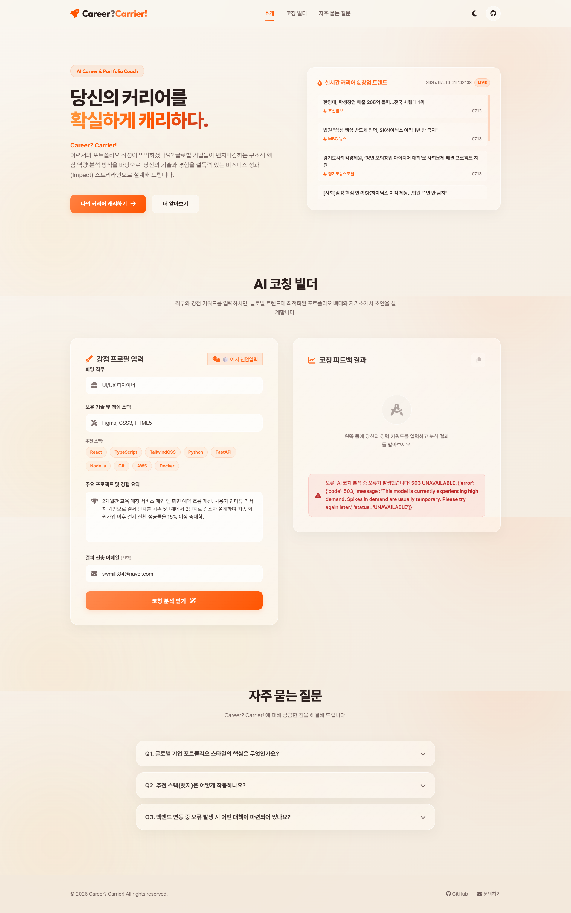

# 🌌 Career? Carrier! — AI 커리어 코칭 웹 서비스

> 서비스 슬로건: **"당신의 커리어에 우아한 빛을 더하다."**
>
> 희망 직무, 보유 기술 스택, 프로젝트 경험을 입력하면 Google Gemini AI가 자기소개서 강점 초안과 포트폴리오 구성 전략을 생성해주는 AI 커리어 코칭 웹 서비스입니다.

---

| 항목 | 내용 |
|---|---|
| 🌐 **배포 URL** | [https://swmilk4u-1.vercel.app](https://swmilk4u-1.vercel.app) |
| 💾 **GitHub 저장소** | [https://github.com/swmilk4u/N2_A1-3](https://github.com/swmilk4u/N2_A1-3) |
| 📋 **노션 DB (AI 분석 결과 저장)** | [노션 데이터베이스 바로가기](https://app.notion.com/p/3a5ce80de197806ab961ce5eadeb72bd?v=3a5ce80de19780ff89e9000c9baf8581) |

---

## 📑 목차

1. [서비스 기획서](#1-서비스-기획서)
2. [AI 기능 설계 (입력 / 출력 / 실패 처리)](#2-ai-기능-설계)
3. [기술 스택](#3-기술-스택)
4. [프로젝트 폴더 구조](#4-프로젝트-폴더-구조)
5. [로컬에서 직접 실행하기](#5-로컬에서-직접-실행하기)
6. [Vercel 배포 방법 및 환경 변수 설정](#6-vercel-배포-방법-및-환경-변수-설정)
7. [보너스 과제 구현 내용](#7-보너스-과제-구현-내용)
8. [평가 기준별 자체 검증 (Q&A)](#8-평가-기준별-자체-검증-qa)
9. [AI 코딩 도구 활용 증빙](#9-ai-코딩-도구-활용-증빙)
10. [서비스 동작 스크린샷](#10-서비스-동작-스크린샷)

---

## 1. 서비스 기획서

### 🎯 서비스 목적

취업 준비생과 이직 희망자 대부분이 "내용은 있는데 어떻게 써야 할지 모르겠다"는 어려움을 겪습니다.
**Career? Carrier!** 는 사용자가 입력한 경험과 기술 키워드를 AI가 분석해 **자기소개서 초안**과 **포트폴리오 구성 전략**을 바로 제안해 줍니다.

### 👥 타겟 사용자

| 사용자 유형 | 어려움 | 서비스가 해결하는 것 |
|---|---|---|
| 신입 개발자 / 디자이너 | 포트폴리오 구성 전략이 막막함 | AI가 강점 중심 스토리라인 제안 |
| 이직 준비생 (주니어/미들) | 기존 경험을 어떻게 표현할지 모름 | 채용 공고 트렌드에 맞는 언어로 번역 |
| 비전공자 / 부트캠프 수료생 | 프로젝트 경험을 자소서에 녹이기 어려움 | STAR 기법 기반 초안 자동 생성 |

### 🎨 페이지 구성 (3개 섹션 이상)

| 섹션 | 내용 | 이동 방법 |
|---|---|---|
| **① Home / Hero** | 서비스 소개 + 실시간 트렌드 뉴스룸 | 상단 네비게이션 |
| **② AI 코칭 빌더** | 입력 폼 + AI 분석 결과 카드 | 상단 메뉴 또는 스크롤 |
| **③ FAQ & Guides** | 자주 묻는 질문 아코디언 | 상단 메뉴 |

> 상단 네비게이션 바를 통해 각 섹션으로 바로 이동할 수 있으며, 다크/라이트 테마 토글 버튼으로 화면 분위기를 바꿀 수 있습니다.

### 📱 반응형 대응

- **데스크톱** (1200px 이상): 좌우 2컬럼 레이아웃
- **태블릿** (768px ~ 1199px): 1컬럼으로 자동 전환
- **모바일** (767px 이하): 입력 폼, 결과 카드 모두 전체 너비로 표시
- CSS Media Query로 구현, 직접 2가지 화면 크기에서 확인 완료

---

## 2. AI 기능 설계

### ✅ 입력 (Input) — 사용자가 입력하는 것

| 필드 | 예시 | 필수 여부 |
|---|---|---|
| 희망 직무 | `React 프론트엔드 개발자` | ✅ 필수 |
| 보유 기술 스택 | `React, TypeScript, TailwindCSS` | ✅ 필수 |
| 주요 프로젝트 및 경험 | `3개월간 오픈마켓 토이 프로젝트 제작. CORS 오류 해결 후 성공적으로 런칭` | ✅ 필수 |
| 결과를 받을 이메일 | `user@example.com` | 선택 (입력 시 이메일 자동 발송) |

### ✅ 출력 (Output) — AI가 생성해주는 것

1. **✨ 자기소개서 강점 기술 초안** (500자 내외)
   - STAR 기법(상황-과제-행동-결과)을 활용한 구조화된 자소서 본문
2. **🚀 포트폴리오 빌드업 전략**
   - 보유 기술이 돋보이는 프로젝트 구성 가이드 (Markdown 형식)

> 결과는 화면 우측 카드에 마크다운 렌더링으로 표시되며, 상단 **복사하기** 버튼으로 전체 복사가 가능합니다.

### ⚠️ 실패 처리 (최소 1개 이상 → 3가지 모두 구현)

| 실패 유형 | 언제 발생하나? | 사용자에게 보여주는 것 |
|---|---|---|
| **① 빈 입력 차단** | 필수 항목을 비운 채 제출 버튼을 누를 때 | 적색 에러 배너 + 우측 하단 토스트 팝업 |
| **② API 오류 처리** | 서버에서 500 오류 또는 AI API 장애 발생 시 | 적색 경고 배너에 상세 에러 메시지 표시 |
| **③ 타임아웃 방지** | AI 응답이 60초를 초과하는 경우 | 요청 자동 취소(AbortController) + 안내 문구 표시 |

### 🧪 테스트 시나리오

| 케이스 | 입력값 | 기대 결과 |
|---|---|---|
| 정상 입력 | 직무/기술/경험 모두 입력 | 스켈레톤 로딩 후 AI 결과 카드 출력 |
| 빈 입력 | 아무것도 입력 안 함 | 전송 차단 + 에러 메시지 표시 |
| 긴 입력 / 지연 | 1000자 이상 텍스트 | 60초 초과 시 자동 취소 + 타임아웃 안내 |

---

## 3. 기술 스택

| 구분 | 기술 | 사용한 이유 |
|---|---|---|
| **프론트엔드** | 순수 HTML5 + CSS3 + JavaScript | 과제 조건 (React 등 프레임워크 사용 금지) |
| **백엔드** | Python 3.12 (Vercel Serverless) | 과제 조건 (api/ 폴더에 Python 함수) |
| **AI 연동** | Google Gemini API (`google-genai`) | Gemini Flash 모델로 자소서 및 포트폴리오 전략 생성 |
| **마크다운 렌더링** | Marked.js | AI 응답(마크다운)을 웹 화면에 보기 좋게 표시 |
| **폰트 / 아이콘** | Google Fonts (Outfit, Inter) + FontAwesome 6 | 프리미엄 디자인 구현 |

> **AI 모델 Fallback 전략**: gemini-2.0-flash → gemini-flash-latest 순서로 자동 전환됩니다. 하나가 실패해도 다음 모델이 자동으로 응답합니다.

---

## 4. 프로젝트 폴더 구조

```text
N2_A1-3_AI website/
│
├── index.html               ← 웹 페이지 본체 (프론트엔드)
├── README.md                ← 프로젝트 보고서 및 문서
├── requirements.txt         ← Python 패키지 목록 (Vercel 빌드 시 자동 설치됨)
├── vercel.json              ← Vercel 배포 라우팅 설정
├── .gitignore               ← API 키 등 민감 파일이 GitHub에 올라가지 않도록 제외
│
├── api/                     ← 백엔드 (Vercel Serverless Functions)
│   ├── coach.py             ← AI 코칭 분석 엔드포인트 (/api/coach)
│   └── news.py              ← 실시간 뉴스 RSS 파서 엔드포인트 (/api/news)
│
├── 02_source/               ← 프론트엔드 정적 파일 및 로컬 개발 도구
│   ├── dev_server.py        ← 로컬 테스트용 개발 서버
│   ├── css/
│   │   └── style.css        ← 글래스모피즘 테마 + 반응형 레이아웃 스타일
│   └── js/
│       └── main.js          ← 폼 제출, fetch 호출, 에러 처리, 타임아웃 로직
│
└── 01_document/             ← 과제 제출용 문서 및 증빙 자료
    ├── N2_A1-3 과제미션.txt
    ├── ai_chat_history.md   ← AI 코딩 도구 협업 과정 증빙
    └── screenshots/         ← 스크린샷 증빙 이미지
        ├── desktop_view.png
        ├── mobile_view.PNG
        ├── ai_function_view.png
        ├── empty_1.png
        └── ai_function_error.png
```

> **핵심 구조 설명**: 프론트엔드(`index.html`, `css/`, `js/`)와 백엔드(`api/`)가 명확하게 분리되어 있습니다. Vercel은 `api/` 폴더 안의 Python 파일을 자동으로 서버리스 함수로 인식합니다.

---

## 5. 로컬에서 직접 실행하기

> Vercel 배포 없이 로컬 환경에서 서비스를 직접 실행하고 테스트하는 방법입니다.

### Step 1. 코드 내려받기 (Clone)

```bash
git clone https://github.com/swmilk4u/N2_A1-3.git
cd N2_A1-3
```

### Step 2. Python 패키지 설치

```bash
pip install -r 02_source/requirements.txt
```

> `pip`이 없다면 먼저 Python 3.9 이상을 설치해 주세요.

### Step 3. 환경 변수(.env) 파일 설정

프로젝트 루트에 `.env` 파일을 만들고 아래와 같이 입력합니다.

```env
# 필수
GEMINI_API_KEY=여기에_본인의_Gemini_API_키를_입력하세요

# 선택 (노션 DB 자동 저장 사용 시)
NOTION_API_KEY=여기에_노션_통합_토큰을_입력하세요
NOTION_DATABASE_ID=여기에_노션_DB_아이디를_입력하세요

# 선택 (이메일 자동 발송 사용 시)
SMTP_USER=yourmail@gmail.com
SMTP_PASSWORD=구글_앱_비밀번호
```

> ⚠️ `.env` 파일은 절대 GitHub에 올리면 안 됩니다. `.gitignore`에 이미 등록되어 있어 자동으로 제외됩니다.

### Step 4. 로컬 서버 실행

```bash
python 02_source/dev_server.py
```

브라우저에서 `http://localhost:8080` 으로 접속하면 됩니다.

---

## 6. Vercel 배포 방법 및 환경 변수 설정

> Vercel은 GitHub 저장소와 연동하여 `git push` 시 자동으로 재배포되는 서버리스 호스팅 플랫폼입니다.

### Step 1. GitHub에 코드 올리기

```bash
git add .
git commit -m "feat: 기능 개발 완료"
git push origin main
```

### Step 2. Vercel과 GitHub 연동

1. [vercel.com](https://vercel.com) 에 로그인
2. **Add New > Project** 클릭
3. GitHub 저장소(`N2_A1-3`) 선택 후 **Import**

### Step 3. 환경 변수 등록

> **왜 환경 변수로 관리하나요?**
> API 키를 코드에 직접 넣으면 GitHub에 공개되어 해킹 위험이 있습니다. Vercel의 환경 변수 기능을 사용하면 키를 안전하게 서버 내부에만 보관할 수 있습니다.

Vercel 프로젝트 설정 → **Environment Variables** 탭에서 아래 항목을 추가합니다:

| Key (변수 이름) | 필수 여부 | 설명 |
|---|---|---|
| `GEMINI_API_KEY` | ✅ 필수 | Google AI Studio에서 발급한 Gemini API 키 |
| `NOTION_API_KEY` | 선택 | Notion Integrations에서 발급한 `ntn_...` 토큰 |
| `NOTION_DATABASE_ID` | 선택 | 연동할 노션 DB의 ID (URL에서 확인 가능, 32자리) |
| `SMTP_USER` | 선택 | 발신용 Gmail 주소 (예: `yourmail@gmail.com`) |
| `SMTP_PASSWORD` | 선택 | Gmail 앱 비밀번호 (2단계 인증 후 발급) |
| `SMTP_SERVER` | 선택 | 기본값: `smtp.gmail.com` |
| `SMTP_PORT` | 선택 | 기본값: `587` (TLS) |
| `AUTO_WEBHOOK_URL` | 선택 | Discord/Slack/Make.com Webhook 주소 |

### Step 4. Deploy!

**Deploy** 버튼을 클릭하면 약 30~60초 후 고유한 URL이 생성됩니다.

> 이후 `git push`만 하면 자동으로 재배포됩니다.

---

## 7. 보너스 과제 구현 내용

### 🏆 보너스 ①: 운영 자동화 — 3중 파이프라인 구현

> 사용자가 AI 코칭을 받으면 → 자동으로 저장하고 알림을 보내는 흐름

#### 📋 노션 DB 자동 적재 (Notion Database Integration)

- AI 분석 완료 시 Notion API로 결과가 자동으로 노션 데이터베이스에 새 페이지로 저장됩니다.
- 저장 항목: 희망 직무, 보유 기술, 경험 요약, AI 분석 결과 전문
- [노션 DB에서 직접 확인하기](https://app.notion.com/p/3a5ce80de197806ab961ce5eadeb72bd?v=3a5ce80de19780ff89e9000c9baf8581)
- 환경 변수: `NOTION_API_KEY`, `NOTION_DATABASE_ID`

> **어떻게 동작하나?**: `api/coach.py` → `requests.post("https://api.notion.com/v1/pages", ...)` 로 노션 서버에 직접 데이터를 전송합니다.

#### 📧 이메일 자동 발송 (SMTP)

- 사용자가 이메일 주소를 입력하면 AI 분석 결과가 해당 이메일로 자동 발송됩니다.
- Python 내장 `smtplib` 라이브러리를 사용 (외부 서비스 불필요)
- 환경 변수: `SMTP_USER`, `SMTP_PASSWORD`

#### 🔔 Webhook 알림

- `AUTO_WEBHOOK_URL`을 설정하면 Discord/Slack으로 실시간 알림이 전송됩니다.

> **안전 설계**: 환경 변수가 설정되어 있지 않으면 해당 기능만 조용히 건너뛰고 나머지 서비스는 정상 작동합니다.

---

### 🏆 보너스 ②: UX 고도화

#### 🎲 예시 랜덤입력 자동 완성

- 폼 상단의 **🎲 예시 랜덤입력** 버튼 클릭 시 4가지 직군(프론트엔드/백엔드/데이터엔지니어/디자이너) 샘플 데이터가 무작위로 자동 입력됩니다.
- 신규 사용자의 초기 입력 부담(Cold Start)을 낮춰 서비스 진입 장벽을 최소화합니다.

#### 🌐 실시간 트렌드 뉴스룸

- 구글 뉴스 RSS를 백엔드(`/api/news`)에서 실시간으로 가져와 화면에 표시합니다.
- `이직 OR 창업 OR 채용` 키워드, `when:14d` (최근 14일 이내) 필터 적용
- 네트워크 장애 시에도 모크업 데이터로 자동 대체(Fallback) 됩니다.

#### 🌙 다크 / 라이트 테마 토글

- 우측 상단 버튼으로 다크/라이트 테마를 전환할 수 있습니다.
- 선택한 테마는 브라우저에 저장(`localStorage`)되어 다음 방문 시에도 유지됩니다.

---

## 8. 평가 기준별 자체 검증 (Q&A)

---


| 평가 항목 | 결과 | 근거 |
|---|---|---|
| 배포 URL로 접속 가능하고 최소 3개 이상 섹션이 메뉴 이동으로 확인되는가? | ✅ PASS | [swmilk4u-1.vercel.app](https://swmilk4u-1.vercel.app) 접속 가능. Hero / AI 코칭 빌더 / FAQ 3개 섹션 + 상단 네비게이션 이동 |
| 모바일에서 레이아웃이 깨지지 않고 정상 동작하는가? | ✅ PASS | CSS Media Query로 데스크톱/태블릿/모바일 3단계 반응형 구현. 스크린샷 §10 확인 |
| AI 기능이 "입력 → 요청 → 결과 표시"까지 정상 동작하는가? | ✅ PASS | 입력 폼 제출 → `/api/coach` POST → Gemini AI 생성 → marked.js 렌더링 |
| 정상/빈값/긴 입력 등 2~3개 테스트 입력으로 동작이 재현 가능한가? | ✅ PASS | §2 테스트 시나리오 3케이스 모두 재현 가능 (스크린샷 §10 포함) |
| 실패 상황에서 사용자 안내 메시지가 1개 이상 표시되는가? | ✅ PASS | 빈 입력 차단, API 오류 배너, 60초 타임아웃 안내 3가지 모두 구현 |
| API 키가 코드에 노출되지 않고 환경 변수로만 관리되는가? | ✅ PASS | `.gitignore`로 `.env` 제외, Vercel 환경 변수 대시보드에서만 관리 |
| 제출 패키지(필수 5종)가 모두 제공되는가? | ✅ PASS | ① 배포 URL ② GitHub 저장소 ③ README.md ④ 서비스 기획서(§1) ⑤ 스크린샷 + AI 도구 증빙(§9,§10) |

---


**Q1. html/css/js/api 구조를 왜 이렇게 나눴는가?**

| 구분 | 역할 | 위치 |
|---|---|---|
| `index.html` | 웹페이지 전체 구조(뼈대) 정의 | 루트 |
| `02_source/css/style.css` | 시각 스타일, 반응형, 애니메이션 | 02_source/css/ |
| `02_source/js/main.js` | 사용자 이벤트 처리, fetch 호출, 결과 렌더링 | 02_source/js/ |
| `api/coach.py` | Gemini AI 호출, Notion 저장, 이메일 발송 | api/ |

> HTML은 구조, CSS는 표현, JS는 동작, Python API는 비즈니스 로직으로 역할을 명확히 분리하여 유지보수성과 과제 요구사항(프레임워크 금지, Python 백엔드)을 동시에 충족합니다.

**Q2. 프론트 로직에서 "로딩/성공/실패" 상태를 어떻게 처리했는가?**

```
[제출 버튼 클릭]
  ├─ 빈 값 → 전송 중단 + 에러 배너 표시 (실패: 프론트 검증)
  └─ 정상 값 → 스켈레톤 로딩 UI 표시 (로딩)
       ├─ 60초 초과 → AbortController로 fetch 취소 + 타임아웃 안내 (실패: 지연)
       ├─ HTTP 오류(4xx/5xx) → 적색 에러 배너 표시 (실패: API 오류)
       └─ 성공 응답 → marked.js 파싱 후 결과 카드 렌더링 (성공)
```

**Q3. Serverless Function(Python)에서 입력 검증과 응답 포맷을 어떻게 정했는가?**

- **입력 검증**: `coach.py`에서 `job`, `skills`, `experience` 필드가 비어 있으면 즉시 `{"success": false, "error": "..."}` 반환
- **응답 포맷**: `{"success": true, "result": "AI 생성 텍스트"}` 형식으로 통일. 프론트에서 `data.success`로 분기 처리
- **에러 포맷**: `{"success": false, "error": "상세 메시지"}` 로 일관된 구조 유지

**Q4. 배포 후 발생한 문제를 어떤 순서로 진단하고 수정했는가?**

1. **증상 확인**: 배포 URL에서 API 호출 시 오류 발생 확인
2. **로그 조회**: `vercel logs <URL>` 명령으로 런타임 에러 메시지 확인
3. **원인 파악**: 로그에서 에러 유형 식별 (예: `NOTION_API_KEY is missing`)
4. **코드/설정 수정**: 원인에 따라 `coach.py` 수정 또는 Vercel 환경 변수 등록
5. **재배포**: `git push` 또는 `vercel redeploy`로 반영
6. **재확인**: 로그로 수정 결과 검증

> 실제 발생한 오류 3건은 §2 Q6(배포 오류 사례)에 상세 기록되어 있습니다.

---


**Q5. HTML/CSS/JavaScript의 역할 차이를 코드 예시로 설명하면?**

| 기술 | 역할 | 이 프로젝트 코드 예시 |
|---|---|---|
| **HTML** | 웹페이지의 구조(뼈대) 정의 | `<form id="coachForm">`, `<textarea id="skills">` |
| **CSS** | 구조에 시각적 스타일 적용 | `.glass-card { backdrop-filter: blur(20px); }`, `@media (max-width: 767px)` |
| **JavaScript** | 사용자 행동에 반응하는 동적 로직 | `form.addEventListener('submit', ...)`, `fetch('/api/coach', {...})` |

**Q6. fetch 요청이 서버리스 함수로 전달되고 응답이 돌아오는 흐름은?**

```
① 브라우저 JS: fetch('/api/coach', { method: 'POST', body: JSON.stringify({job, skills, experience}) })
② Vercel 라우터: /api/coach 경로 → api/coach.py 실행
③ Python: 입력 파싱 → Gemini API 호출 → 결과 반환
④ Python: return {"success": true, "result": "..."} as JSON
⑤ JS: response.json() → marked.parse(data.result) → DOM 주입
```

**Q7. 환경 변수를 쓰는 이유(보안/운영)?**

- **보안**: API 키를 코드에 하드코딩하면 GitHub 공개 저장소를 크롤링하는 봇이 수 초 내에 탈취. 탈취된 키로 수십만 원의 무단 과금 발생 가능
- **운영**: 로컬(`.env` 파일)과 배포(Vercel 환경 변수)에서 동일한 코드로 다른 키를 안전하게 주입 가능. 키 변경 시 코드 수정 없이 환경 변수만 교체

**Q8. AI 기능을 이 서비스에 넣은 이유와 프롬프트 구성 방식은?**

- **이유**: 구직 준비 시 자기소개서 작성에 가장 많은 시간이 소요됨. AI가 사용자의 단편적 키워드를 전문가 수준의 서술로 변환해주면 준비 시간을 크게 단축 가능
- **프롬프트 구성**:
  ```
  System: 커리어 코치 역할 지정 (한국어, 전문가 어조)
  User: 희망 직무 + 보유 기술 + 경험 요약 → STAR 기법 자소서 초안 + 포트폴리오 전략 요청
  ```
- Gemini `gemini-2.0-flash` 1차 시도 → 실패 시 `gemini-flash-latest`로 자동 Fallback

---


**Q9. 응답 지연이 잦다면 어떤 개선 옵션을 고려할 수 있는가?**

| 개선 방향 | 방법 | 효과 |
|---|---|---|
| **모델 경량화** | 더 빠른 소형 모델(`gemini-flash`) 사용 | 응답 속도 2~3배 향상 |
| **스트리밍 응답** | Gemini Streaming API + SSE(Server-Sent Events) | 첫 글자부터 실시간 표시 |
| **캐싱** | 동일 입력 결과를 Redis/KV에 캐싱 | 중복 요청 시 즉시 응답 |
| **쿼터 분산** | 여러 Gemini 프로젝트 API 키를 라운드로빈으로 사용 | 무료 쿼터 한도 확장 |

**Q10. AI 기능을 2개로 늘린다면 프론트/백엔드 구조를 어떻게 확장할 것인가?**

- **백엔드**: `api/coach.py`(자소서) 외 `api/interview.py`(면접 예상 질문 생성) 추가 → Vercel이 자동으로 `/api/interview` 엔드포인트로 인식
- **프론트엔드**: `main.js`에 새 fetch 함수 추가, 결과 표시용 새 카드 컨테이너를 `index.html`에 추가
- **공통 로직**: Gemini 호출 코드를 `api/utils.py`로 분리해 두 핸들러에서 공통 사용

**Q11. API 키가 유출되었다면 즉시 취해야 할 조치는?**

1. **즉시 폐기**: Google AI Studio / Notion / Gmail 각 콘솔에서 해당 키 즉시 삭제
2. **신규 발급**: 새 API 키 발급
3. **환경 변수 교체**: Vercel 대시보드에서 새 키로 교체 후 재배포
4. **이력 정리**: 키가 커밋 이력에 포함된 경우 `git filter-branch` 또는 BFG Repo-Cleaner로 제거
5. **재발 방지**: `.gitignore` 재확인, GitHub Secret Scanning 알림 설정

**Q12. 요구사항이 "프론트 프레임워크 허용"으로 바뀐다면?**

| 항목 | 내용 |
|---|---|
| **선택 프레임워크** | Next.js (React 기반, Vercel 최적화) |
| **장점** | 컴포넌트 재사용, 상태 관리 용이, SEO 개선(SSR), 개발 생산성 향상 |
| **단점** | 번들 크기 증가, 빌드 시간 추가, 학습 곡선, Node.js 런타임 필요 |
| **변경 범위** | `index.html` + `main.js` + `style.css` → React 컴포넌트로 전환 (백엔드 `api/` 폴더는 그대로 유지 가능) |


---

## 9. AI 코딩 도구 활용 증빙

> AI 코딩 도구를 활용하여 개발한 과정의 협업 로그 및 증빙 자료입니다.

📄 **AI 대화 로그 파일**: [01_document/ai_chat_history.md](01_document/ai_chat_history.md)

| 단계 | AI 도구 활용 내용 |
|---|---|
| 기획 | 서비스 아이디어 구체화 및 UX 설계 방향 자문 |
| 프론트엔드 | 글래스모피즘 CSS 스타일, 반응형 레이아웃, 마크다운 렌더링 구현 |
| 백엔드 | Gemini API 연동, Notion API 적재 로직, SMTP 이메일 발송 구현 |
| 배포 | Vercel 환경 변수 등록, vercel.json 설정, 배포 오류 디버깅 |

---

## 10. 서비스 동작 스크린샷

### 🖥️ 데스크톱 뷰 (Desktop View)


### 📱 모바일 뷰 (Mobile View)


### ⚙️ AI 기능 동작 화면 (AI Function View)


### ⚠️ 빈 입력 실패 처리 화면

> 필수값을 입력하지 않고 제출 시, 에러 배너 및 토스트 팝업으로 즉시 안내합니다.



### 🚫 API 오류 처리 화면

> API 오류(4xx/5xx) 발생 시 적색 경고 배너로 상세 에러 정보를 제공합니다.


