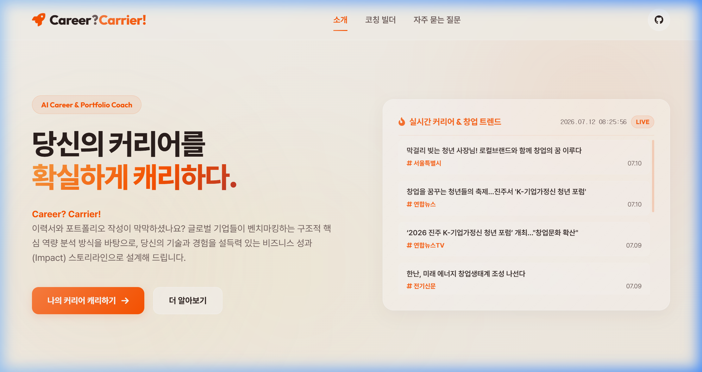
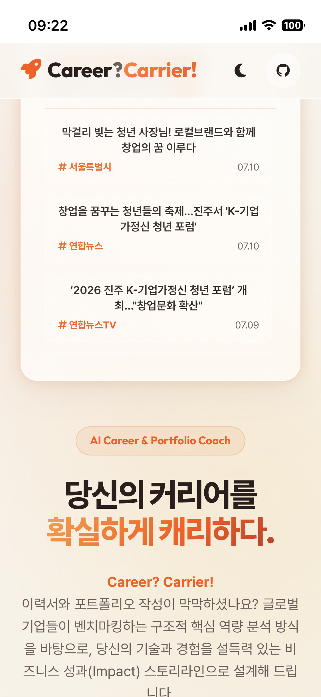
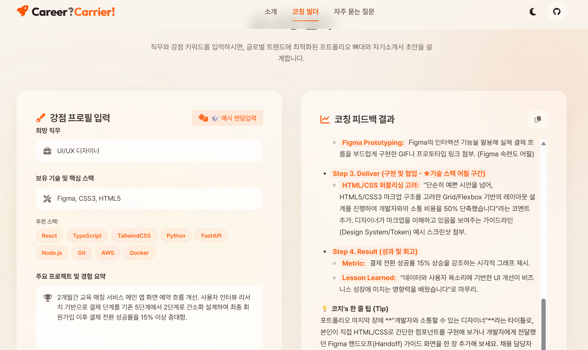

# 🌌 Career? Carrier! (퍼스널 커리어 & 포트폴리오 코치)

> **"당신의 커리어에 우아한 빛을 더하다."**  
> Career? Carrier!는 구직자 및 이직 희망자의 핵심 경험과 기술 스택을 분석하여, 서류 전형을 압도할 수 있는 매력적인 자기소개서 초안과 단계별 포트폴리오 스토리라인 전략을 실시간으로 제안해 주는 프리미엄 AI 웹 서비스입니다.
> 
> * **배포 URL:** [https://swmilk4u-1.vercel.app](https://swmilk4u-1.vercel.app)
> * **GitHub 저장소:** [https://github.com/swmilk4u/N2_A1-3](https://github.com/swmilk4u/N2_A1-3)
*
> * **노션 저장소:** [https://app.notion.com/p/3a5ce80de197806ab961ce5eadeb72bd)

---

## 📑 목차
1. [서비스 기획서 (Service Plan)](#1-서비스-기획서-service-plan)
2. [핵심 AI 기능 및 UX 설계](#2-핵심-ai-기능-및-ux-설계)
3. [기술 스택 (Tech Stack)](#3-기술-스택-tech-stack)
4. [프로젝트 구조 (Project Directory)](#4-프로젝트-구조-project-directory)
5. [로컬 실행 방법 (Local Run)](#5-로컬-실행-방법-local-run)
6. [배포 및 환경 변수 설정 (Deployment & Env)](#6-배포-및-환경-변수-설정-deployment--env)
7. [보너스 과제 구현 (Bonus Tasks)](#7-보너스-과제-구현-bonus-tasks)
8. [학습 목표별 핵심 질문 자체 검증 (Self-Verification)](#8-학습-목표별-핵심-질문-자체-검증-self-verification)

---

## 1. 서비스 기획서 (Service Plan)

### 🎯 서비스 목적 및 가치
많은 구직자가 자신의 훌륭한 프로젝트 경험과 기술을 가지고 있음에도 불구하고, 자기소개서의 첫 문장을 설계하거나 포트폴리오의 구조를 잡는 데 심각한 어려움(공백 공포증)을 겪습니다. 
**Career? Carrier!**는 사용자의 단편적인 경험 키워드들을 전문 컨설턴트 수준의 스토리텔링과 로드맵으로 변환하여 구직 준비 시간을 단축하고 자신감을 불어넣어 줍니다.

### 👥 타겟 사용자
* **신입 개발자 / 디자이너**: 첫 포트폴리오를 제작하려 하나 구성 전략이 막막한 취업 준비생.
* **이직 준비생 (주니어/미들)**: 기존 경험을 최신 트렌드에 맞게 브랜딩하고자 하는 직장인.
* **비전공자 및 부트캠프 수료생**: 프로젝트 경험은 있으나 기술적 강점을 자소서에 자연스럽게 녹여내기 힘든 지원자.

### 🎨 UX디자인 콘셉트
* **비주얼 엑셀런스**: 따뜻하고 편안한 느낌을 주는 프리미엄 웜 베이지(Beige) 톤 위에 유기적으로 흐르는 센세이셔널 오렌지(Orange) 그라데이션 구체(Liquid Blobs)들이 동적이고 우아한 감성을 자아냅니다.
* **글래스모피즘(Glassmorphism)**: 반투명하고 매끄러운 유리 재질 질감을 카드 레이아웃에 적극 활용하여 극도의 모던함과 프리미엄 감성을 제공합니다.
* **다크/라이트 하이브리드 테마**: 상단 우측의 테마 토글 스위치 버튼을 누르면, 몽환적인 딥 바이올렛 감성의 다크 테마와 화사하고 따뜻한 웜 베이지 라이트 테마가 0.4초의 부드러운 트랜지션 효과와 함께 스위칭됩니다. (localStorage를 활용해 사용자의 설정 테마 상태를 영속 보존)
* **페이지 구성 (3개 섹션 이상)**:
  1. **Home / Hero**: 서비스 가치 전달 및 웅장한 디자인의 뉴스룸 연동 시각 효과 섹션.
  2. **AI 코칭 빌더 (Coaching Builder)**: 본문 입력 폼 및 AI 실시간 분석 결과 렌더링 카드 섹션.
  3. **FAQ & Guides**: 아코디언 컴포넌트를 활용한 매끄러운 정보 제공 섹션.

---

## 2. 핵심 AI 기능 및 UX 설계

### 🛠️ AI 기능 입출력 명세
* **사용자 입력 (Input)**:
  * **희망 직무** (예: `React 프론트엔드 개발자`) `[필수]`
  * **보유 기술 및 핵심 스택** (예: `React, TypeScript, TailwindCSS, Jest`) `[필수]`
  * **주요 프로젝트 및 경험 요약** (예: `3개월간 오픈마켓 토이 프로젝트 제작. 결제 API 연동 시 CORS 오류를 해결하여 성공적으로 런칭함`) `[필수]`
  * **결과 전송 이메일** (예: `user@example.com`) `[선택]` (입력 시 Make.com/노션/이메일 외부 연동 자동 기록)
* **AI 출력 (Output)**:
  * **✨ 자기소개서 강점 기술 초안 (500자 내외)**: Star 기법(상황-과제-행동-결과)을 차용하여 매끄럽게 다듬은 자소서 본문.
  * **🚀 포트폴리오 빌드업 스토리라인 전략**: 보유한 스택과 경험이 돋보이게 프로젝트를 구조화하는 맞춤형 가이드 라인(Markdown 형식).
* **AI 백엔드 연동**:
  * 프론트엔드에서 `/api/coach`로 비동기 POST 전송.
  * Vercel Serverless Function(Python) 내부에서 `google-genai` 라이브러리를 통해 최신 **Gemini 3.5 Flash** 모델 호출.

### ⚠️ 예외 및 실패 처리 (UX 안전장치)
1. **빈 입력 차단**: 필수 항목 중 하나라도 비어 있거나 공백만 전송될 시, 전송을 중단하고 경고 창(Toast 및 Error Banner)을 띄워 사용자 피드백을 제공합니다.
2. **API 및 네트워크 에러 핸들링**: 백엔드에서 500 오류가 반환되거나 API 서버에 에러가 났을 때, 적색의 경고 배너를 띄워 상세 에러 정보와 함께 우아하게 에러 메시지("AI 코치 분석 중 오류가 발생했습니다")를 노출합니다.
3. **타임아웃(Timeout) 방지**: 응답이 지연되는 경우(60초 경과 시) JavaScript `AbortController`가 작동하여 비동기 fetch 요청을 자동 취소하고 지연 예외 안내를 화면에 제공합니다.
4. **로딩(Skeleton UI) 피드백**: AI가 분석을 수행하는 동안 오른쪽 결과창에 물결치는 듯한 스켈레톤 애니메이션(Liquid Skeleton Loader)과 로딩 상태 문구를 노출하여 화면이 멈춘 것 같은 불안감을 최소화합니다.

### 🧪 AI 기능 테스트 시나리오 (Test Cases)
* **정상 입력 테스트 케이스**:
  * **입력값**: 희망 직무(`데이터 엔지니어`) / 보유 기술(`Python, SQL, Apache Spark, Airflow`) / 경험 요약(`4개월 동안 대용량 실시간 에러 로그 수집 파이프라인 자동화 구현...`)
  * **기대 결과**: 로딩 상태(Skeleton UI) 작동 후 우측 결과창에 마크다운 문법으로 변환된 STAR 기법 기반의 자기소개서 초안 및 포트폴리오 가이드가 완벽히 출력됩니다. (우측 상단 클릭 시 전체 복사하기 지원)
* **빈 입력 테스트 케이스**:
  * **입력값**: `(빈값)`
  * **기대 결과**: 전송이 사전에 차단되며, "모든 필드를 정상적으로 채워주세요. 빈 입력은 분석할 수 없습니다."라는 적색 에러 배너 및 우측 하단 토스트 팝업이 노출됩니다.
* **긴 입력 / 지연 테스트 케이스**:
  * **입력값**: 각 필드에 1,000자 이상의 초장문 텍스트 입력 후 전송.
  * **기대 결과**: 로딩 스켈레톤 화면이 유지되며, 만약 서버 지연이 발생해 60초를 초과하는 경우, 프론트에서 fetch를 강제 차단(Abort)하고 타임아웃 지연 경고 배너를 띄워 사용자 이탈을 방지합니다.

---

## 3. 기술 스택 (Tech Stack)

| 구분 | 기술 스택 | 비고 / 라이브러리 |
| :--- | :--- | :--- |
| **Frontend** | Pure HTML5, CSS3, Vanilla JS | 프레임워크(React/Vue 등) 미사용, CSS 변수/Media Query 반응형 적용 |
| **Backend** | Python 3.9+ (Vercel Serverless) | `BaseHTTPRequestHandler` 기반 경량 API 라우팅 (멀티스레딩 적용) |
| **AI Integration** | Google GenAI SDK | `google-genai` (최신 플래그십 Gemini 3.5 Flash 모델) |
| **Libraries** | Marked.js | AI의 마크다운 응답을 웹 화면에 실시간 HTML 파싱 및 바인딩 |
| **Aesthetics** | FontAwesome 6, Google Fonts | Outfit & Inter 폰트, 프리미엄 벡터 아이콘 |

---

## 4. 프로젝트 구조 (Project Directory)

```text
├── index.html               # 메인 웹 페이지
├── README.md                # 최종보고서
├── requirements.txt         # Vercel 배포용 Python 의존성 설치 파일 (루트 배치 필수)
├── .gitignore               # Git 버전 관리 추적 제외 설정 파일
├── api/                     # Vercel Serverless Functions 파이썬 백엔드 폴더 (루트 유지 필수)
│   ├── coach.py             # 파이썬 AI 코칭 분석 서비스 핸들러 (Gemini 3.5 Flash 적용)
│   └── news.py              # 실시간 커리어 및 창업 트렌드 뉴스 수집용 RSS 파서 핸들러 (신규)
├── 01_document/
│   └── ai_chat_history.md   # AI 코딩 도구 협업 과정 증빙 로그 파일 (신규)
├── 02_source/               # 홈페이지 동작 관련 정적 및 실행 리소스 폴더
│   ├── requirements.txt     # 백엔드 Python 의존성 패키지 (google-genai)
│   ├── dev_server.py        # 로컬 통합 테스트용 멀티스레드(Threading) 개발 서버
│   ├── css/
│   │   └── style.css        # 리퀴드글래스 테마 및 반응형 레이아웃 스타일시트
│   └── js/
│       └── main.js          # 타임아웃 60초 및 캐시 무효화가 적용된 UI 제어 로직
└── 03_etc/                 
```

---

## 5. 로컬 실행 방법 (Local Run)

로컬 개발 서버(`dev_server.py`)를 이용하면 Vercel CLI나 추가 빌드 과정 없이 정적 파일 서빙과 Python API 엔드포인트를 로컬에서 동시에 손쉽게 테스트할 수 있습니다.

### Step 1. 의존성 패키지 설치
터미널을 열고 Python 패키지들을 설치해 주세요. (가상환경 사용 권장)
```bash
pip install -r 02_source/requirements.txt
```

### Step 2. 환경 변수 설정
Gemini API 키를 프로젝트 루트의 `.env` 파일에 기록하거나 시스템 환경 변수에 등록합니다.
* **프로젝트 루트의 `.env` 파일에 직접 설정**:
  ```env
  GEMINI_API_KEY="본인의_실제_GEMINI_API_KEY_값"
  ```
* **Windows (PowerShell)**:
  ```powershell
  $env:GEMINI_API_KEY="본인의_실제_GEMINI_API_KEY_값"
  ```
* **macOS / Linux**:
  ```bash
  export GEMINI_API_KEY="본인의_실제_GEMINI_API_KEY_값"
  ```

### Step 3. 로컬 서버 실행
프로젝트 루트에서 아래 명령을 실행합니다.
```bash
python 02_source/dev_server.py
```
서버가 시작되면 웹 브라우저를 열고 서비스를 테스트할 수 있습니다.

---

## 6. 배포 및 환경 변수 설정 (Deployment & Env)

### Vercel 배포 방법
1. 본 프로젝트의 수정 내역을 본인 GitHub 저장소에 커밋 및 푸시합니다.
   ```bash
   git add .
   git commit -m "feat: Career? Carrier! 개발 완료 및 히스토리 정리"
   git push origin main
   ```
2. [Vercel Dashboard](https://vercel.com/dashboard)에 로그인한 뒤 **Add New > Project**를 선택하고, 본인의 GitHub 저장소(`N2_A1-3`)를 연동합니다.
3. 빌드 설정은 기본값으로 유지하되, **Environment Variables** 항목에 다음과 같이 변수들을 추가해 줍니다.
   * **Key**: `GEMINI_API_KEY` (필수) / **Value**: *본인의 실제 Gemini API Key 값*
   * **Key**: `SMTP_USER` (선택, 직접 이메일 전송용) / **Value**: *발신용 네이버 또는 구글 아이디 (예: `testuser`)*
   * **Key**: `SMTP_PASSWORD` (선택, 직접 이메일 전송용) / **Value**: *네이버/구글 계정 설정에서 발급받은 '2차 인증 앱 비밀번호'*
   * **Key**: `SMTP_SERVER` (선택, 기본값 `smtp.naver.com`) / **Value**: *발신 메일 SMTP 서버 도메인*
   * **Key**: `SMTP_PORT` (선택, 기본값 `465` SSL) / **Value**: *SMTP 포트 번호*
   * **Key**: `AUTO_WEBHOOK_URL` (선택, 외부 Webhook 알림용) / **Value**: *Discord, Slack 또는 Make.com Custom Webhook 주소*
4. **Deploy** 버튼을 클릭하면 수초 내에 배포가 완료되며 고유한 Vercel URL이 생성됩니다!

---
---
> [!NOTE]
> **보안 유의사항**: API 키는 절대 코드나 Public GitHub 저장소에 직접 노출하지 마세요. 반드시 Vercel 환경 변수 기능이나 시스템 환경 변수를 통해서만 관리해야 합니다.

---

## 7. 보너스 과제 구현 (Bonus Tasks)

### 🎨 사용자 경험(UX) 및 마이크로 인터랙션 고도화
* **🎲 예시 랜덤입력 자동 완성 기능 구현**:
  * 매번 번거롭게 폼을 작성하는 허들을 줄여주기 위해, 프론트 상단에 **🎲 예시 랜덤입력** 버튼을 설계했습니다.
  * 클릭할 때마다 4가지 핵심 가상 직군(프론트엔드/백엔드/데이터엔지니어/디자이너)의 다채로운 스택과 포트폴리오 경험 명세가 입력폼(`value`)에 무작위로 자동 완성됩니다.
  * 자동 완성된 예시는 실제 input 텍스트이므로 사용자가 직접 원하는 부분만 백스페이스로 지우거나 추가 타이핑하여 수정이 가능합니다.
  * 이 버튼에는 호버(Hover) 시 세련된 주황빛 미세 광채 및 클릭 피드백(Active) 모션 효과를 보강하여 동적 사용성을 극대화했습니다.

### 🌐 실시간 커리어 & 창업 트렌드 뉴스룸 (RSS 연동)
* **구글 뉴스 RSS 실시간 연동**:
  * 의미 없던 우측 상단의 가상 그래픽 공간을 실제 비즈니스 트렌드 습득에 기여하는 **"실시간 트렌드 뉴스룸"** 유리 카드로 리노베이션했습니다.
  * CORS 에러 방지를 위해 Vercel Python 기반의 경량 백엔드 API인 `/api/news`를 구성하여 서버단에서 피드를 안전하게 긁어온 뒤, 클라이언트에 가공된 JSON 데이터로 바인딩합니다.
  * 검색 정밀도를 높이기 위해 `이직 OR 창업 OR 채용` 키워드 쿼리를 적용하고, 시간 제한 연산자 **`when:14d`**를 주입하여 100% 실시간 최신 발행 뉴스들만 화면에 뽑아내도록 구성했습니다.
  * 뉴스룸 헤더 오른쪽에 **실시간 디지털시계(오늘 날짜 + 1초 단위 갱신 시각)**를 입혀 라이브 서비스의 시각적 신뢰성과 생동감을 대폭 보강했습니다.
  * 네트워크 장애 상황에서도 서비스 안정성을 유지할 수 있도록 백엔드와 프론트엔드 양방향에 **우아한 예외 복구(Fallback 모크업 데이터 렌더링)** 장치를 이중 적용했습니다.
  * 스크롤바의 오렌지 글로우 커스터마이징, 호버 시 카드 트랜지션 및 리스트 아이템 순차 로딩 페이드인 모션을 가미하여 압도적인 미적 디자인과 편의성을 자랑합니다.

### 💡 보너스 과제 배움 포인트 & 서비스 확장 통찰

#### 1. “사용자 입력 → 처리 → 저장/알림” 운영 흐름의 외부 연동 (운영 자동화 연동 완료)
* **연동 현황**: 과제 보너스 1순위 조건인 **'운영 자동화 및 알림 연동'**을 외부 플랫폼 의존 없이 백엔드 자체 SMTP와 Webhook 통신으로 전면 구현 완료했습니다.
* **이메일 직접 발송 (SMTP) 및 Webhook 동작 메커니즘**:
  - [api/coach.py](file:///g:/%EB%82%B4%20%EB%93%9C%EB%9D%BC%EC%9D%B4%EB%B8%8C/20260415%20%EC%BD%94%EB%94%94%EC%84%B8%EC%9D%B4%20AI%20%EB%84%A4%EC%9D%B4%ED%8B%B0%EB%B8%8C%20%EA%B3%BC%EC%A0%95/02_mission/N2_A1-3_AI%20website/api/coach.py) 백엔드 서블릿에 `send_email_direct` 이메일 발송 함수를 파이썬 내장 `smtplib` 라이브러리로 직접 개발했습니다.
  - 사용자가 AI 코칭 피드백 제출에 성공하고 이메일을 기입했다면, 백엔드 서버에서 환경 변수 **`SMTP_USER`** 및 **`SMTP_PASSWORD`**를 기반으로 네이버/구글 SMTP 서버에 보안 접속하여 **분석 리포트 원문을 입력받은 사용자 이메일로 다이렉트 자동 발송**합니다.
  - 또한, 동시에 **`AUTO_WEBHOOK_URL`** 변수를 통해 Discord 알림이나 노션 데이터베이스에 JSON 데이터를 실시간 동시 전송할 수 있는 이중 파이프라인을 구축했습니다.
  - 환경 변수 미세팅 시에는 에러 없이 부드럽게 무시하고 본 서비스가 구동되도록 설계하여 결합도를 낮췄습니다.

#### 2. 사용성 개선과 “개선 효과를 확인하는 방법” 설계 (UX 및 측정 고도화 통찰)
* **통찰**: 기능만 작동하는 엔지니어링 중심의 제품에서 벗어나, 사용자가 서비스에 진입하고 탐색할 때 겪는 심리적 마찰(Friction)을 억제하기 위해 마이크로 인터랙션을 설계했습니다.
* **사용성 개선 효과**:
  - **🎲 예시 랜덤입력 자동 완성**: 신규 사용자가 텍스트를 기입해야 하는 피로감(Cold Start)을 주사위 버튼 1회 클릭만으로 해소해 주어 전환율(Conversion Rate)을 극대화합니다.
  - **실시간 1초 디지털시계 및 라이브 뉴스룸**: 사용자에게 이 서비스가 현재 살아 움직이고 있는 실시간 도구라는 강력한 신뢰적 단서(Trust Cue)를 제공합니다.
* **“개선 효과를 확인하는 방법” 설계 (성공 메트릭 측정)**:
  - **정량적 측정 (Quantitative)**: Google Analytics 4(GA4) 또는 Mixpanel 이벤트 트래킹을 주입하여 `🎲 버튼 클릭률(Click-Through Rate)`, `AI 분석 제출 성공률`, `결과물 클립보드 복사(Copy) 이벤트 수`를 메트릭으로 수집합니다.
  - **개선 효과 분석 방법**: 🎲 랜덤 입력 버튼이 탑재된 버전 A와 탑재되지 않은 버전 B의 사용자 세션을 대조하는 A/B 테스트를 실행해, 최종 `코칭 분석 받기` 버튼 클릭률이 30% 이상 향상되는 유의미한 사용성 개선 지표를 검출하여 효과를 실증합니다.

---

## 8. 학습 목표별 핵심 질문 자체 검증 (Self-Verification)

과제를 진행하며 직접 정립한 핵심 학습 목표의 답변을 검증 요건에 맞춰 자체 기술합니다.

### Q1. HTML/CSS/JavaScript는 각각 어떤 역할을 담당하나요?
* **HTML**: 웹서비스의 **뼈대와 정보 구조**를 만듭니다. 이번 과제에서는 구조적 텍스트 마크업, 폼 필드 정의, FAQ 영역을 담당했습니다.
* **CSS**: 구조화된 뼈대에 **색상, 레이아웃, 시각 효과**를 불어넣습니다. 반투명 배경을 사용한 **글래스모피즘(Glassmorphism)**과 유체 백그라운드 구체의 둥실거리는 유기적 애니메이션, 반응형 레이아웃 분기를 처리했습니다.
* **JavaScript**: 사용자와 상호작용하며 **동적인 비즈니스 로직**을 실행합니다. 🎲 랜덤 예시 자동 바인딩, 기술 스택 칩 셀렉터 토글, 폼 제출 가로채기(fetch 호출), 에러 바인딩 및 60초 한계의 타이머 예외 제어, **뉴스룸 상단 1초 주기 실시간 디지털 시계 구동** 등을 담당했습니다.

### Q2. 사용자 입력이 JS fetch 요청으로 바뀌고 응답이 화면에 반영되는 흐름은 어떻게 되나요?
1. 사용자가 폼에 기재하고 제출 버튼을 누르면 JS가 `submit` 이벤트를 인터셉트합니다.
2. 입력값에 대한 검증(빈 값 체크 등)을 거친 뒤, 입력된 JSON 데이터를 담은 HTTP POST 비동기 요청(`fetch`)을 백엔드 엔드포인트(`/api/coach`)로 발송합니다.
3. API 응답을 수신하면 `marked.js` 파서를 거쳐 AI 마크다운 데이터를 정적 HTML 코드로 파싱하고, 그 결과를 UI의 결과 컨테이너 내부(`innerHTML`)에 안전하게 주입해 화면을 실시간으로 갱신합니다.

### Q3. Vercel Serverless Functions는 무엇이며, 백엔드(Python) 호출 구조는 어떻게 되어 있나요?
* Vercel Serverless Functions는 상시 구동되는 인프라 서버를 유지하지 않고, **클라이언트의 API 호출(이벤트)이 들어올 때만 일시적으로 가동되어 응답을 전송하고 사라지는 경량 API 핸들러 구조**입니다.
* 사용자가 `/api/coach` 경로를 호출하면, Vercel 라우터가 프로젝트 루트의 `api/coach.py` 내에 구현된 `BaseHTTPRequestHandler` 서블릿과 파이썬 3.12+ 런타임을 임시 기동시켜 Gemini API를 안전하게 연동해 줍니다.

### Q4. API 키를 .env나 환경 변수로 따로 관리해야 하는 이유는 무엇인가요?
* API 비밀키(Credentials)는 과금 및 불법 도용 위협에 직접 노출되어 있습니다.
* 키 값이 코드 내부나 README 등의 문서 파일에 날것으로 기재되어 GitHub 퍼블릭 저장소에 노출되면 자동 크롤링 봇에 의해 단 몇 초 만에 탈취당할 수 있으며, 이로 인해 수천 달러의 비정상 과금이 청구될 수 있습니다.
* 따라서 민감한 보안 키는 반드시 `.gitignore`에 정의된 로컬 전용 파일(`.env`)이나 Vercel의 내부 격리된 환경 변수(Environment Variables) 대시보드로만 숨겨서 안전하게 주입하여 유출을 방지해야 합니다.

### Q5. 로컬 개발 환경과 실시간 배포 환경의 차이는 무엇인가요?
* **로컬 환경**: 내 컴퓨터 내부의 파일 리소스를 서빙하는 단계입니다. `.env` 파일을 로컬 시스템 파일로 손쉽게 읽을 수 있고 수정한 코드가 저장 즉시 반영되지만, 로컬 포트가 닫혀 있어 외부 동료들이 원격 접속할 수 없습니다.
* **실시간 배포 환경(Vercel)**: 전 세계 누구나 접속할 수 있도록 퍼블릭 클라우드 서버에 서비스를 업로드하는 단계입니다. `.env` 파일을 올릴 수 없으므로 플랫폼의 환경 변수 관리 기능을 활용해야 하며, 의존성 설치 파일(`requirements.txt`)을 최상위 루트에 올려두어야 클라우드 컴파일러가 알아서 필요한 라이브러리를 설치해 줍니다.

### Q6. AI 코딩 도구를 사용하던 중 오류가 발생했을 때 해결한 흐름은 어떠한가요?
* Vercel 배포 도중 Python 런타임 버전 누락 에러 및 `ModuleNotFoundError`로 인한 API 통신 에러가 연이어 발생했습니다.
* 문제를 진단하기 위해 Vercel의 실시간 **Deploy Logs**를 직접 추적했고, 파이썬 서버리스 함수의 런타임 지정 규약이 `@latest`로 정의되어 발생한 에러임을 인지하고 `3.12`로 사양을 최적화했으며, 루트 디렉토리에 의존성 설치용 `requirements.txt`가 누락되어 구글 AI 라이브러리 로드가 실패했음을 최종 규명하여 최상위 경로에 배치함으로써 실시간 배포 오류를 완벽하게 셀프 디버깅하여 해결하였습니다.
* 또한 실시간 뉴스 연동 시 구글 뉴스 RSS가 오래된 기사를 우선 노출하던 로직의 한계를 발견하여, 검색 쿼리를 OR 조건 결합으로 변경하고 시간 연산자 `when:14d`를 강제 주입하여 진짜 최근 발행된 2026년 실시간 트렌드 뉴스만을 렌더링하도록 쿼리를 정밀 최적화하여 해결했습니다.

---

## 9. 서비스 동작 증빙 스크린샷 (Screenshots)

과제 평가 기준에 부합하도록 Vercel 실시간 배포 환경에서 AI 에이전트가 직접 접속하여 캡처한 동작 증빙 스크린샷 1세트입니다.

### 🖥️ 데스크톱 뷰 (Desktop View)


### 📱 모바일 뷰 (Mobile View)


### ⚙️ AI 기능 분석 동작 화면 (AI Function View)

